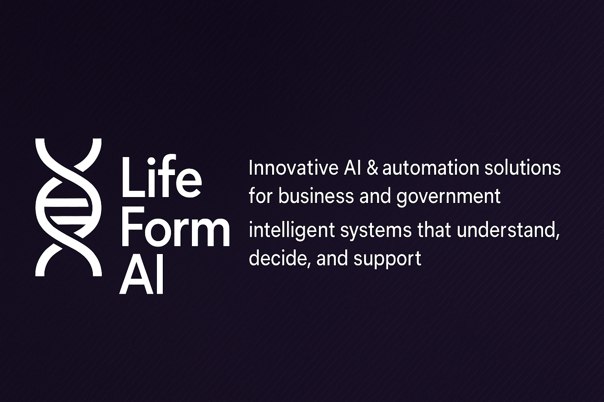

# 🧬 LifeFormAI

**LifeFormAI** ist ein innovatives Technologieunternehmen, spezialisiert auf die Entwicklung intelligenter, skalierbarer Systeme.  
Wir kombinieren modernste **Künstliche Intelligenz**, **Automatisierung** und **Systemintegration**, um maßgeschneiderte, zukunftssichere Lösungen zu liefern.

---

## 🚀 Leistungen & Schwerpunkte
- **AI-Entwicklung** – Sprachmodelle, kontextbasierte Assistenten, Machine Learning.
- **Automatisierung** – Optimierung und Automatisierung komplexer Geschäftsprozesse.
- **Systemintegration** – Vernetzung bestehender Systeme und Plattformen.
- **Sicherheitslösungen** – Datenschutz-konforme Architekturen für sensible Daten.

---

## 🌟 Vision
Technologie schaffen, die **versteht**, **entscheidet** und **unterstützt** –  
nicht nur reagiert.  
LifeFormAI steht für **maßgeschneiderte, intelligente Lösungen**, die nachhaltig Mehrwert schaffen.

---

## 📂 Projektportfolio (Auszug)
- **ALISE** – Modularer AI-Agent für Sprache, Logik und Automatisierung.
- **LifeForm Core** – Interne Plattform für zentralisierte AI- und Systemlogik.
- **NeuroFlow** – Verarbeitungspipeline für kontextbezogene Antworten in Echtzeit.

---

## 🛠 Kerntechnologien

---

## 📫 Kontakt
  
  

---

> © 2025 LifeFormAI – All rights reserved.
